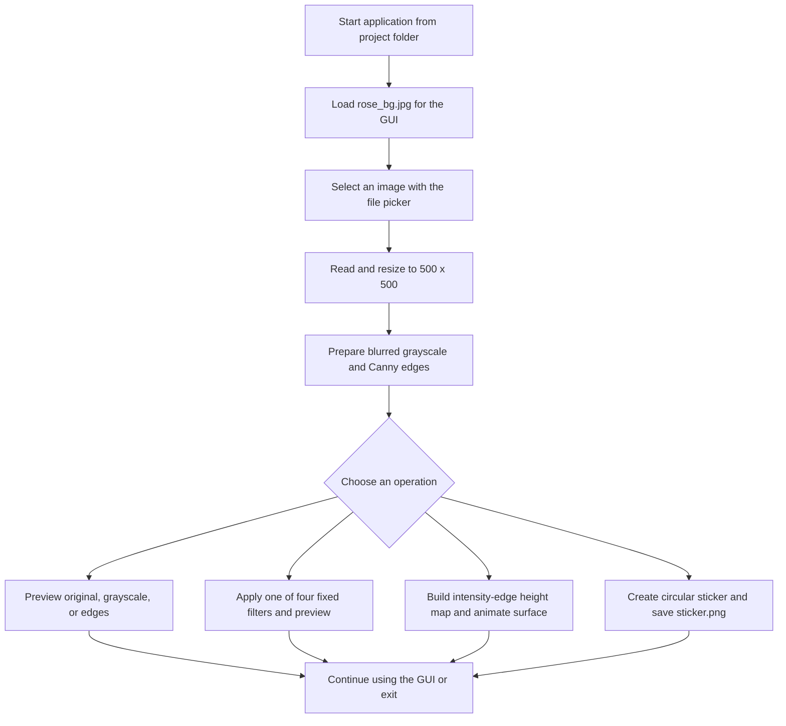
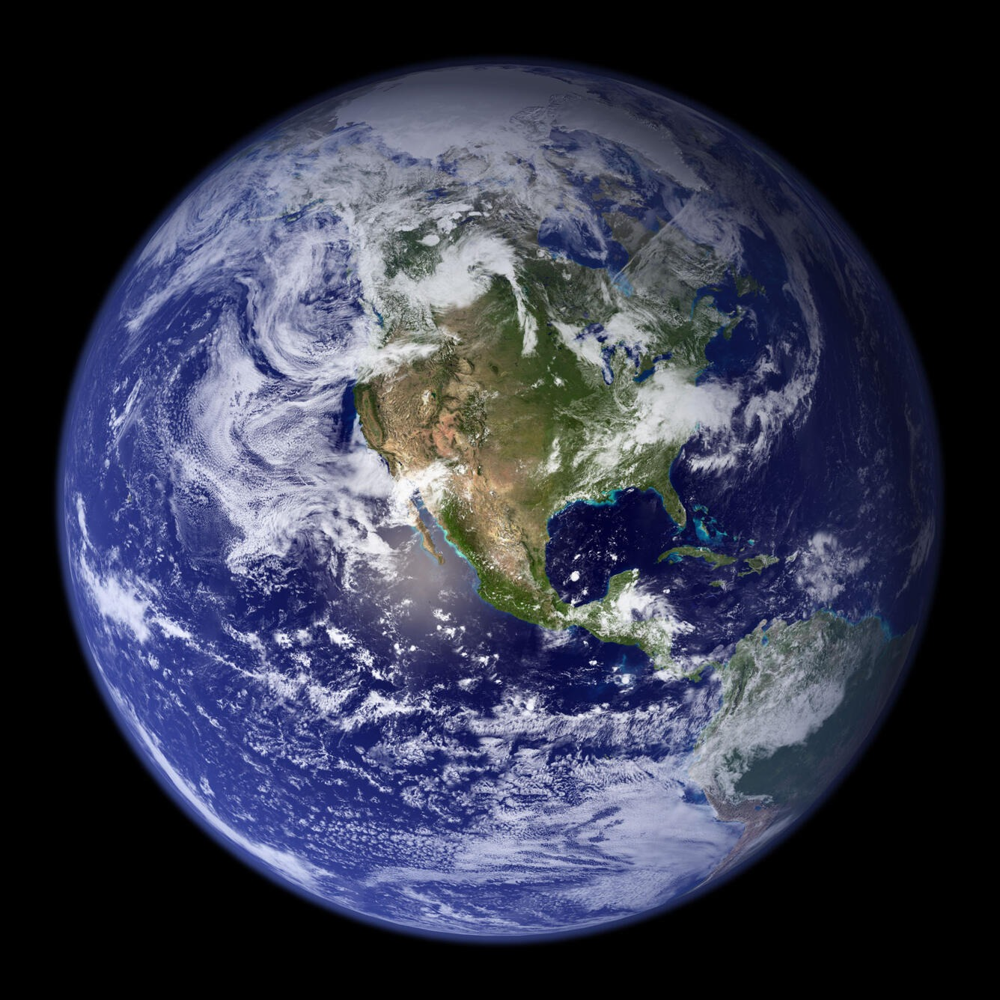
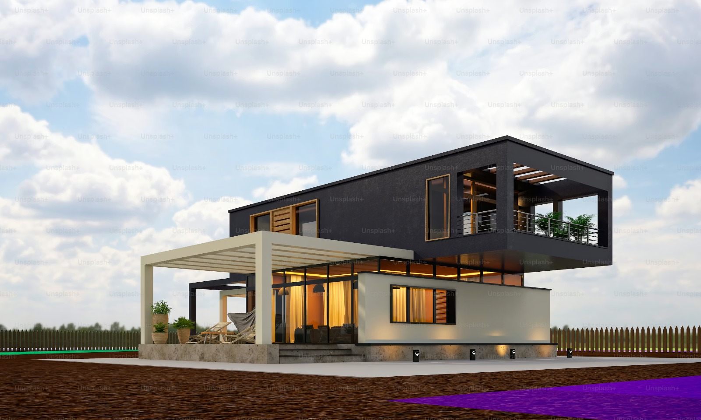

# PixelVista: Interactive Image Processing & Visualization 

A Python desktop application for interactive image processing, visual filters, edge-based visualization, and circular sticker creation. The project combines OpenCV operations with a Tkinter interface and a Matplotlib-based rotating surface view.

Repository name: `Image_Processing_MiniProject`.

> The 3D view is a visualization derived from image intensity and edges. It is not a reconstructed 3D object, and the project does not implement AI or machine learning.

## Table of Contents

- [Project Overview](#project-overview)
- [Problem Statement and Objectives](#problem-statement-and-objectives)
- [Key Features](#key-features)
- [Technologies and Libraries](#technologies-and-libraries)
- [Image Processing Techniques](#image-processing-techniques)
- [How It Works](#how-it-works)
- [Processing Workflow](#processing-workflow)
- [Project Structure](#project-structure)
- [Inputs and Outputs](#inputs-and-outputs)
- [Screenshots and Sample Images](#screenshots-and-sample-images)
- [Installation Requirements](#installation-requirements)
- [Installation](#installation)
- [Run the Application](#run-the-application)
- [How to Use](#how-to-use)
- [Example Usage](#example-usage)
- [Results](#results)
- [Advantages and Limitations](#advantages-and-limitations)
- [Future Enhancements](#future-enhancements)
- [Learning Outcomes](#learning-outcomes)
- [Project Report](#project-report)
- [Author](#author)
- [License](#license)

## Project Overview

Image Processing Mini Project is a local desktop GUI for loading one image and viewing several transformations. After upload, the interface enables controls for the original image, grayscale and Canny edge views, four visual filters, a rotating surface visualization, and a sticker generator.

The application is implemented in [`image_generator.py`](image_generator.py). It uses a fixed 500 × 500 working image and displays previews in the application window. The included Earth and house images are sample files users can select; they are not loaded automatically.

## Problem Statement and Objectives

The accompanying report frames the project as a way to bring basic image processing and creative visual outputs into one approachable interface. The implementation's objectives are to:

- Load and preview an image through a desktop GUI.
- Provide grayscale and edge-detection views.
- Apply a small set of fixed visual filters.
- Visualize image-derived values as a rotating surface.
- Create a framed, circular sticker image with a caption.

## Key Features

- Open an image using a file picker.
- Resize the selected image to 500 × 500 pixels for processing.
- Preview the original, processed grayscale, and detected edges.
- Apply Snapchat-style smoothing/brightness, warm, black-and-white, and cool-tone presets.
- Animate a Matplotlib surface generated from grayscale intensity and edge values.
- Create a circular-masked sticker with a colored border and the text “Thank You, Visit Again”; save it as `sticker.png`.

## Technologies and Libraries

| Technology | Role in the project |
| --- | --- |
| Python | Application language |
| Tkinter | Desktop window, buttons, labels, file picker, and scheduled animation updates |
| OpenCV | Image loading, resizing, color conversion, filtering, edge detection, masking, drawing, and sticker output |
| NumPy | Image-array calculations, clipping, mesh generation, and conversion of the plotted canvas |
| Pillow | Convert arrays to images and create Tk-compatible previews; load the GUI background |
| Matplotlib | Plot and animate the image-derived 3D surface |

Python imports `tkinter` from the standard library. The third-party packages needed by the script are `opencv-python`, `numpy`, `Pillow`, and `matplotlib`. There is no dependency manifest in the repository.

## Image Processing Techniques

| Operation | Implementation in the source |
| --- | --- |
| Input preparation | OpenCV reads the selected file and resizes it to 500 × 500. |
| Grayscale preview | Converts BGR to grayscale, then applies a 5 × 5 Gaussian blur with automatic sigma (`0`). The blurred grayscale is displayed. |
| Edge preview | Applies Canny edge detection to the blurred grayscale image, using thresholds 100 and 200. |
| Snapchat-style filter | Bilateral filter with parameters `9, 75, 75`, followed by `convertScaleAbs` with `alpha=1.2` and `beta=30`. |
| Warm filter | Adds 40 to the red channel and 20 to the green channel in the OpenCV BGR array, clipping values to 0–255. |
| Black-and-white filter | Converts the original to grayscale and applies `convertScaleAbs` with `alpha=1.5` and `beta=20`. |
| Cool-tone filter | Adds 40 to the blue channel in the BGR array, clipping values to 0–255. |
| Surface visualization | Converts the original to grayscale, detects Canny edges at thresholds 100 and 200, and computes `(0.6 × grayscale + 0.4 × edges) / 255` as the plotted height values. |
| Sticker | Uses a filled circular mask (radius 200 on a 500 × 500 image), a white outside area, a colored frame, and a caption rendered with OpenCV. |

The labels for the filters are preset names in the interface; they do not indicate integration with Snapchat or Instagram services.

## How It Works

At startup, the script loads `rose_bg.jpg` from the current working directory and constructs the Tkinter window. Image-dependent buttons remain disabled until the user selects an image. The selected image is resized, and the grayscale and edge versions are prepared for their preview buttons.

Most actions replace the preview in the main window. The surface view redraws a Matplotlib plot while rotating its viewing angle; **Stop 3D** ends the scheduled updates. **Create Sticker** writes the generated file to the current working directory. Other preview operations do not save image files.

## Processing Workflow



## Project Structure

```text
Image_Generator/
├── README.md
├── image_generator.py
├── earth.jpeg
├── house.jpeg
├── rose_bg.jpg
└── python_report.pdf
```

`sticker.png` is created in the current working directory when the sticker action is used; it is not included in the repository by default.

## Inputs and Outputs

| Type | Details |
| --- | --- |
| User input | An image selected through the Tkinter file picker. It is resized to 500 × 500 without preserving its original aspect ratio. |
| Included sample inputs | `earth.jpeg` and `house.jpeg`; choose either through the file picker to process it. |
| GUI background | `rose_bg.jpg`, opened by the script at startup using a path relative to the current working directory. |
| On-screen results | Original, grayscale, edges, filter previews, and the animated surface view appear in the GUI. |
| Saved result | The sticker action writes `sticker.png` to the current working directory. With the current fixed input and frame sizes, the output canvas is 580 × 620 pixels. |

The script does not provide a save/export action for the other previews.

## Screenshots and Sample Images

The repository contains sample images and a GUI background, but no captured application screenshots or generated output examples. The following are image assets, not screenshots:

**Earth sample input (`earth.jpeg`)**



**House sample input (`house.jpeg`)**



**Rose-themed application background (`rose_bg.jpg`)**


## Installation Requirements

- A Python installation with Tkinter available.
- A graphical desktop session supported by Tkinter.
- The four third-party packages listed below.
- Run the program with the project root as the current working directory so `rose_bg.jpg` can be found.

The source does not declare a minimum Python version. Tkinter is commonly included with the official Windows Python installer; on other platforms, it may need to be installed through the operating system's Python package.

## Installation

Open a terminal in the project root and install the third-party dependencies:

```bash
python -m pip install opencv-python numpy Pillow matplotlib
```

## Run the Application

From the project root, run:

```bash
python image_generator.py
```

## How to Use

1. Start the application from the project folder.
2. Select **Upload Image** and choose an image file.
3. Use **Original**, **Grayscale**, or **Edges** to inspect the prepared views.
4. Select one of the filter buttons to preview its preset transformation.
5. Select **Generate 3D** to start the rotating surface view; select **Stop 3D** to stop it.
6. Select **Create Sticker** to write `sticker.png` in the process's current working directory.
7. Select **Exit** to close the application.

## Example Usage

For example, launch the program, choose `earth.jpeg` in the file picker, and select **Edges** to see the Canny result. Choose **Create Sticker** to generate `sticker.png` in the current working directory. The included sample images are not preselected by the application.

## Results

The source implements interactive previews for the listed image views and filters, plus an animated surface and a saved sticker file. No output image files or benchmark measurements are included in the repository, so this README makes no performance or quality claims.

## Advantages and Limitations

**Advantages**

- Several introductory image operations are accessible from one desktop window.
- The input, grayscale, and edge views can be compared interactively.
- The project demonstrates image-array operations, GUI integration, plotting, and a simple saved output.

**Limitations**

- Every selected image is resized to 500 × 500, which can distort its aspect ratio.
- Filter parameters and the sticker shape, caption, and output filename are fixed in the source.
- The non-sticker operations only update the preview; they do not export processed files.
- The surface is an intensity-and-edge height-map visualization, not measured scene depth or a true 3D reconstruction.
- The application expects `rose_bg.jpg` in the current working directory and does not include a user-facing image validation or error-recovery flow.
- The repository does not include a dependency manifest or captured application screenshots.

## Future Enhancements

Possible next steps, not currently implemented, include preserving the input aspect ratio, making filter parameters adjustable, adding an output location/format choice for processed previews, improving invalid-file handling, and adding screenshots of actual application results. The project report also discusses broader future possibilities; these are proposals, not existing application features.

## Learning Outcomes

The code provides a practical example of connecting OpenCV image operations to a Tkinter GUI, working with NumPy image arrays, displaying images through Pillow, and plotting a Matplotlib surface. It also demonstrates separating image preparation and button actions into functions and using Tkinter's event loop to schedule animation updates.

## Project Report

The accompanying 25-page report is available at [`python_report.pdf`](python_report.pdf). It is titled “Python-Based Digital Image Processing Application With 3D Visualization.”

## Author

Nisarga NS, as credited on the report title page.

## License

No license file or licensing terms are present in the repository.
